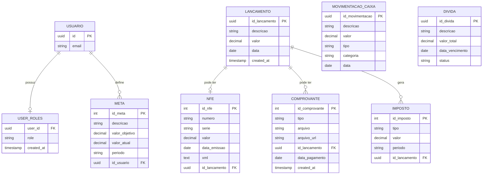

# Documento de Entidade-Relacionamento (DER) - Finansys Mobile

Este documento descreve a estrutura de dados do projeto Finansys Mobile, detalhando as entidades, seus atributos e os relacionamentos entre elas.

## 1. Entidades e Atributos

### 1.1 Usuário (auth.users - Nativo Supabase)
Entidade responsável pela autenticação e identificação única dos usuários no sistema.
- **id** (UUID, PK): Identificador único do usuário.
- **email** (String): E-mail do usuário.

### 1.2 Papéis do Usuário (user_roles)
Define as permissões de cada usuário no sistema.
- **user_id** (UUID, FK): Referência ao usuário.
- **role** (String): Papel do usuário (ex: 'admin', 'user').
- **created_at** (Timestamp): Data de criação do registro.

### 1.3 Lançamento (lancamento)
Registro principal de transações financeiras.
- **id_lancamento** (Integer/UUID, PK): Identificador único do lançamento.
- **descricao** (String): Descrição da transação.
- **valor** (Numeric): Valor da transação.
- **data** (Date): Data do lançamento.
- **created_at** (Timestamp): Data de registro no sistema.

### 1.4 Nota Fiscal Eletrônica (nfe)
Informações detalhadas de notas fiscais associadas a lançamentos.
- **id_nfe** (Integer, PK): Identificador único da NFe.
- **numero** (String): Número da nota fiscal.
- **serie** (String): Série da nota fiscal.
- **valor** (Numeric): Valor total da nota.
- **data_emissao** (Date): Data de emissão da nota.
- **xml** (Text): Conteúdo XML da nota (opcional).
- **id_lancamento** (Integer/UUID, FK): Referência ao lançamento associado.

### 1.5 Comprovante (comprovante)
Arquivos e evidências de pagamentos/recebimentos.
- **id_comprovante** (Integer, PK): Identificador único do comprovante.
- **tipo** (String): Tipo do comprovante (ex: 'boleto', 'transferência').
- **arquivo** (String): Nome do arquivo original.
- **arquivo_url** (String): Caminho do arquivo no storage.
- **id_lancamento** (Integer/UUID, FK): Referência ao lançamento associado.
- **data_pagamento** (Date): Data em que o pagamento foi realizado.

### 1.6 Imposto (imposto)
Registros de impostos calculados ou pagos.
- **id_imposto** (Integer, PK): Identificador único do imposto.
- **tipo** (String): Tipo do imposto (ex: 'ISS', 'ICMS').
- **valor** (Numeric): Valor do imposto.
- **periodo** (String): Período de apuração.
- **id_lancamento** (Integer/UUID, FK): Referência ao lançamento que gerou o imposto.

### 1.7 Movimentação de Caixa (movimentacao_caixa)
Registros de fluxo de caixa direto (entradas e saídas rápidas).
- **id_movimentacao** (UUID, PK): Identificador único da movimentação.
- **descricao** (String): Descrição da movimentação.
- **valor** (Numeric): Valor movimentado.
- **tipo** (Enum): 'receita' ou 'despesa'.
- **categoria** (String): Categoria da movimentação.
- **data** (Date): Data da movimentação.

### 1.8 Dívida (divida)
Controle de obrigações financeiras futuras ou pendentes.
- **id_divida** (Integer/UUID, PK): Identificador único da dívida.
- **descricao** (String): Descrição da dívida.
- **valor_total** (Numeric): Valor total da dívida.
- **data_vencimento** (Date): Data prevista para pagamento.
- **status** (String): Status atual (ex: 'pendente', 'paga', 'vencida').

### 1.9 Meta (meta)
Objetivos financeiros definidos pelos usuários.
- **id_meta** (Integer, PK): Identificador único da meta.
- **descricao** (String): Descrição do objetivo.
- **valor_objetivo** (Numeric): Valor total a ser alcançado.
- **valor_atual** (Numeric): Valor já acumulado/alcançado.
- **periodo** (String): Periodicidade da meta (ex: 'mensal', 'anual').
- **id_usuario** (UUID, FK): Referência ao usuário dono da meta.

---

## 2. Diagrama Entidade-Relacionamento (Visual)

